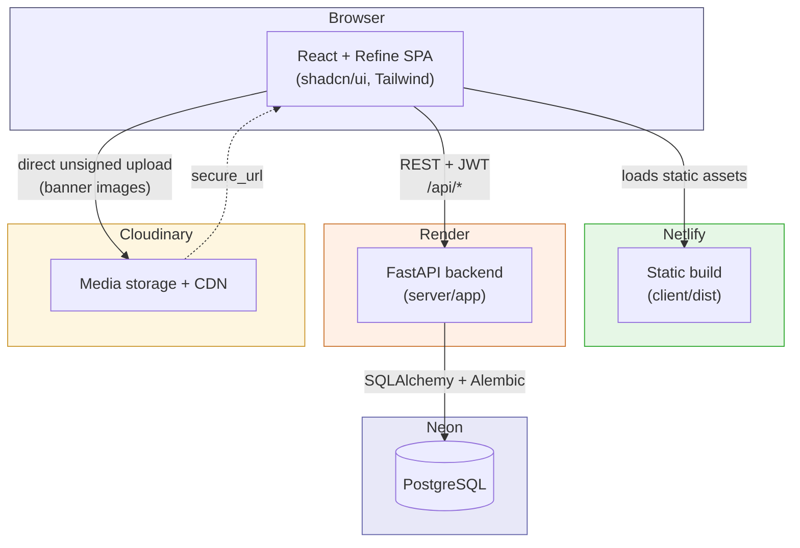
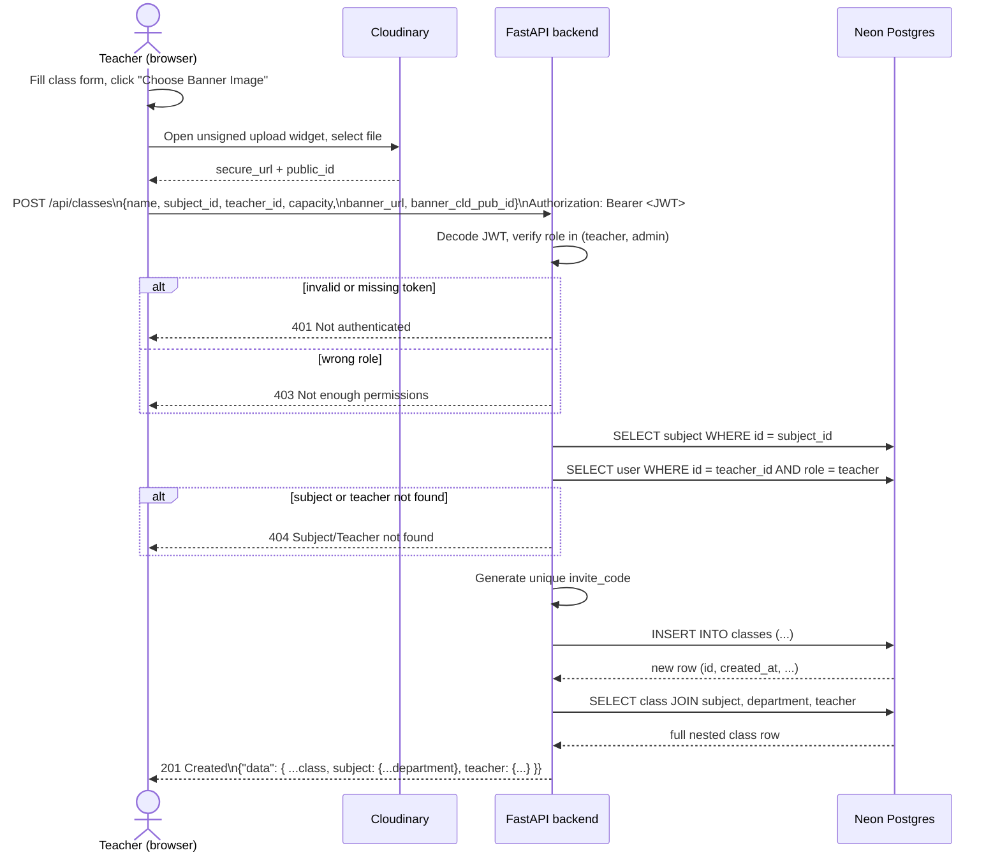
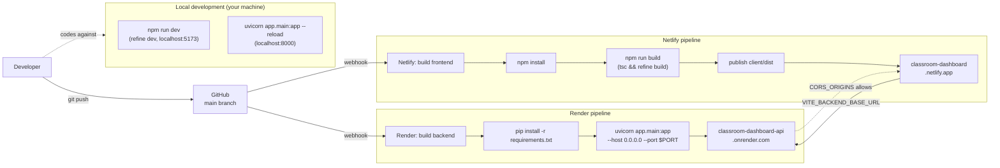

# Project Diagrams

## 1. Architecture Diagram

**Key point:** class banner images go straight from the browser to Cloudinary — the FastAPI backend never receives or touches the file itself, only the returned `secure_url` / `public_id` strings.

## 2. API Sequence Diagram — Create Class with Banner Image

## 3. CI/CD Pipeline Diagram

**`npm run dev` vs `npm run build`:** `npm run dev` (top-left box) is only ever run locally, by a developer, while coding — it starts a live-reloading dev server and never touches production. `npm run build` (inside the Netlify pipeline) is what actually produces the static files that get deployed; Netlify runs this itself on every push, not `npm run dev`.
